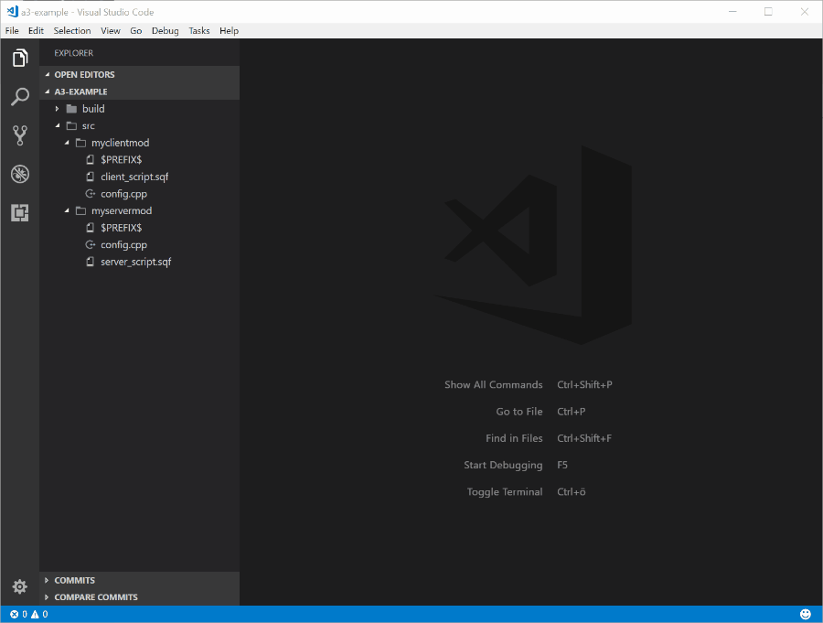

# Arma Dev

Building Arma 3 mod made easier using the Arma Dev tooling extension
This Visual Studio Code extensions will optimize your workflow on building and singing pbo's, automate execution and installations.

## Features

* Build your extension or add existing into the Arma-Dev configuration
* Generate private keys
* Pack server and client pbo files (incl. signing) with a single command
* Install the client mod into the correct game directory
* Run and debug (using *.RPT file) on the fly

## Usage

Before using the Arma Dev extension, please make sure you have properly installed the Arma 3 Tools from Steam.

Open your existing Arma (server / client) and run the `Arma 3: Configure` command the setup the project.
Please refer to the **Configuration** section for further details

Below you can find all available commands

* `Arma 3: Configure`: to setup the project
* `Arma 3: Pack`: to pack pbos defined in your configuration file
* `Arma 3: Binarize`: binarize cpp files from explorer context menu
* `Arma 3: UnBinarize`: Unbinarize bin files from explorer context menu
* `Arma 3: Run`: to start the game from your local computer
* `Arma 3: Run (With Logging)`: to start the game and display the logfile
* `Arma 3: Generate Key`: generate a private key to sign the client pbo's
* `Arma 3: Transfer Files`: transfer server pbos to destination server using SFTP

## Configuration

The configuration file is located in `.vscode/arma-dev.json` and contains the following options.

* `title`: The title of your project (no used yet)
* `name`: The short name of the addon (this name is used as output folder)
* `author`: author name
* `buildPath`: destination folder of all pbo files being generated
* `privateKey`: the private key path being used to sign the client addon
* `serverDir`: all server directories a pbo files should be created for (E.g. core and core_config)
* `clientDirs`: all client directories a pbo files should be created for (ussualy its one or none)
* `clientMods`: additional client mods being loaded when running arma 3
* `version`: a version number to track possible changes (not immplemented)
* `ftpConnection`: setup SFTP connection using host, username and password (optionally path)
* `ftpConnectionFile`: setup SFTP connection by using a separate file

## Requirements

* Arma 3 Tools (http://store.steampowered.com/app/233800/Arma_3_Tools/)
* Visual Studio Code

PLEASE MAKE SURE STEAM IS RUNNING AS IT IS REQUIRED FOR PACKING

## Extension Settings

* `arma-dev.logLevel`: setup the log level (Info | Debug | Error)

## TODO

* implement installation command for client
* implement installation command for server (remote file transfer) 

## Release Notes

First implementation of ftp file transfer the serverDir pbo onto a remote destination (only sftp is supported)

### 0.0.4

* hotfix `Arma 3: Configure` was broken at start
* command title correction

### 0.0.3

* implemented SFTP connection to transfer files to server
* fixed binarize commands when executed from non-context

### 0.0.2

* run arma with mods included (configurable / default: current project)
* fixed AddonBuilder when building client pbo files (packonly mode with signing)

### 0.0.1

* Initial release